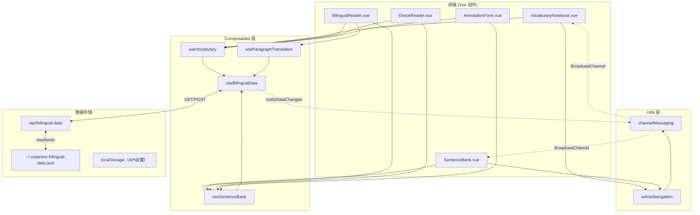
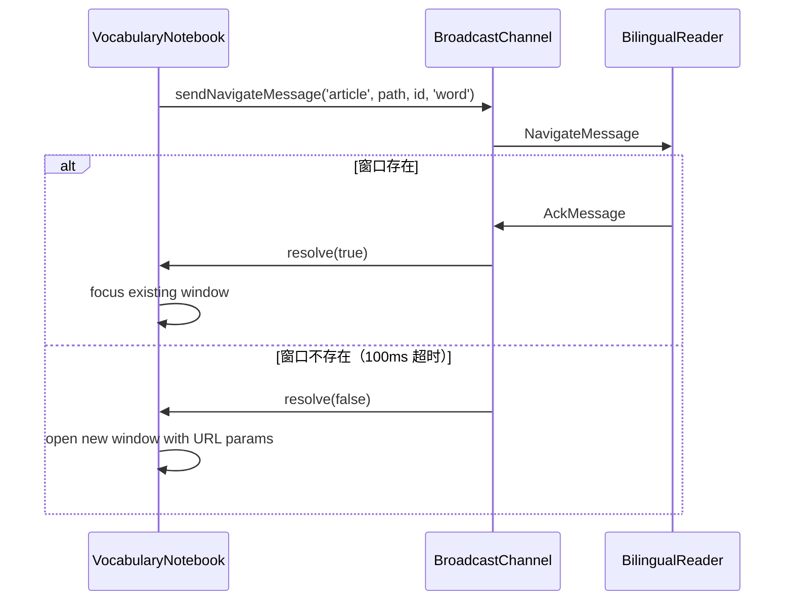
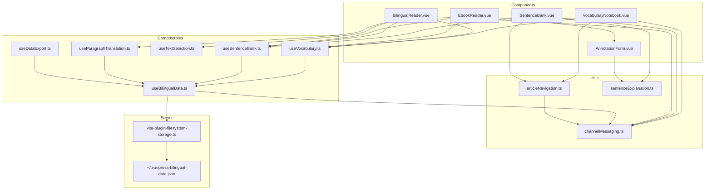

# 拾语 (Shiyu) 项目技术文档

> 本文档详细描述了项目的技术实现，供未来改进代码时参考。**请严格遵循这些架构决策和设计模式**。

---

## 目录

1. [项目概述](#项目概述)
2. [技术栈](#技术栈)
3. [项目结构](#项目结构)
4. [核心架构](#核心架构)
5. [数据管理模块](#数据管理模块)
6. [组件详解](#组件详解)
7. [工具函数](#工具函数)
8. [服务端API](#服务端api)
9. [数据类型定义](#数据类型定义)
10. [关键设计约束](#关键设计约束)
11. [常见陷阱与解决方案](#常见陷阱与解决方案)

---

## 项目概述

**拾语**是一个基于 VuePress Hope 主题的双语阅读学习平台。

### 核心功能

| 功能模块 | 描述 | 主要组件 |
|----------|------|----------|
| 📝 生词本 | 添加、删除、复习单词，支持导出到 Anki | `VocabularyNotebook.vue` |
| 📖 长难句库 | 保存复杂句子及结构分析 | `SentenceBank.vue` |
| 📰 文章阅读 | 双语文章阅读，支持划词添加 | `BilingualReader.vue` |
| 📚 电子书阅读器 | EPUB 格式支持，CFI 定位 | `EbookReader.vue` |
| 🌐 段落翻译 | AI 辅助翻译，可编辑保存 | `ParagraphTranslationBox.vue` |
| ✨ 每日一言 | ONE APP 集成 | `NavbarDailyQuote.vue` |
| ⚙️ API 设置 | 配置 AI 翻译服务 | `ApiSettings.vue` |
| 💾 数据管理 | 导入/导出全部数据 | `NavbarDataManager.vue` |

---

## 技术栈

```yaml
框架: VuePress 2.x + Hope 主题
前端: Vue 3 (Composition API)
语言: TypeScript
构建: Vite
电子书: epub.js / foliate-js
状态管理: 模块级单例响应式对象（非 Vuex/Pinia）
跨窗口通信: BroadcastChannel API
数据存储: 服务端 JSON 文件
```

---

## 项目结构

```
docs/.vuepress/
├── components/                         # 全局 Vue 组件
│   ├── EbookReader.vue                # 电子书阅读器（1257行）
│   └── LandingPage.vue                # 首页着陆页（26KB）
│
├── plugins/
│   └── bilingual-pack/                # 核心双语功能插件
│       ├── client/
│       │   ├── components/            # 插件级组件（15个）
│       │   │   ├── AnnotationForm.vue       # 标注对话框（AI生成释义）
│       │   │   ├── AnnotationTooltip.vue    # 标注悬浮提示
│       │   │   ├── ApiSettings.vue          # API配置（48KB）
│       │   │   ├── ArticleManager.vue       # 文章管理
│       │   │   ├── BilingualReader.vue      # 双语阅读器（1091行）
│       │   │   ├── BilingualToggle.vue      # 双语开关
│       │   │   ├── NavbarBilingualToggle.vue
│       │   │   ├── NavbarDailyQuote.vue     # 每日一言（30KB）
│       │   │   ├── NavbarDataManager.vue    # 数据导入导出
│       │   │   ├── ParagraphTranslationBox.vue
│       │   │   ├── SelectionPopover.vue     # 选中文本弹窗
│       │   │   ├── SentenceBank.vue         # 长难句库（576行）
│       │   │   ├── Toast.vue                # 提示组件
│       │   │   └── VocabularyNotebook.vue   # 生词本（1027行）
│       │   │
│       │   ├── composables/           # 可复用逻辑 Hook（10个）
│       │   │   ├── useBilingualData.ts      # 🌟 数据管理中心
│       │   │   ├── useVocabulary.ts         # 生词本操作
│       │   │   ├── useSentenceBank.ts       # 长难句操作
│       │   │   ├── useTextSelection.ts      # 文本选择处理
│       │   │   ├── useParagraphTranslation.ts  # 段落翻译
│       │   │   ├── useDataExport.ts         # 数据导入导出
│       │   │   ├── useArticles.ts           # 文章管理
│       │   │   ├── useEbooks.ts             # 电子书管理
│       │   │   └── useBilingualToggle.ts    # 双语开关
│       │   │
│       │   ├── utils/                 # 工具函数（9个）
│       │   │   ├── articleNavigation.ts     # 文章导航
│       │   │   ├── channelMessaging.ts      # 跨窗口通信
│       │   │   ├── notebookNavigation.ts    # 笔记本导航
│       │   │   ├── oneApi.ts                # ONE APP API
│       │   │   ├── sentenceExplanation.ts   # 长难句解析
│       │   │   └── dailyQuote.ts            # 每日一言
│       │   │
│       │   ├── types/                 # TypeScript 类型定义
│       │   │   └── index.ts
│       │   └── config.ts              # 插件配置
│       └── index.ts                   # 插件入口
│
├── vite-plugin-filesystem-storage.ts  # 🌟 服务端数据存储 API
├── config.ts                          # VuePress 配置
├── client.ts                          # 客户端入口
└── theme.ts                           # 主题配置
```

---

## 核心架构

### 1. 数据流架构



### 2. 数据状态管理

项目**不使用 Vuex/Pinia**，而是采用**模块级单例响应式对象**：

```typescript
// useBilingualData.ts - 全局单例数据
const data = reactive<BilingualData>({
    vocabulary: [],      // 生词列表
    sentences: [],       // 长难句列表
    translations: {}     // 段落翻译 Map
})
```

**关键设计决策**：
- 所有 composables 共享同一个 `data` 对象（单例模式）
- 使用 `watch` + `setTimeout` 防抖自动保存（500ms）
- 使用 `isReloading` 标志防止 reload 时触发 save（**避免无限循环**）
- 跨窗口数据同步通过 `BroadcastChannel` 实现

---

## 数据管理模块

### 1. useBilingualData（数据管理中心）⭐

**文件**: `plugins/bilingual-pack/client/composables/useBilingualData.ts`

**职责**: 统一管理所有双语数据的加载、保存和同步

#### 核心状态

| 变量 | 类型 | 说明 | 重要性 |
|------|------|------|--------|
| `data` | `reactive<BilingualData>` | 全局共享的响应式数据对象 | ⭐⭐⭐ |
| `isInitialized` | `ref<boolean>` | 数据是否已初始化 | ⭐⭐ |
| `isReloading` | `ref<boolean>` | 是否正在重新加载 | ⭐⭐⭐ **关键！防止无限循环** |
| `vocabSaveTimer` | `ReturnType<typeof setTimeout>` | 词汇保存防抖计时器 | ⭐ |
| `sentenceSaveTimer` | `ReturnType<typeof setTimeout>` | 句子保存防抖计时器 | ⭐ |
| `lastVocabSaveTime` | `number` | 上次词汇保存时间戳 | ⭐ |
| `lastSentenceSaveTime` | `number` | 上次句子保存时间戳 | ⭐ |

#### 核心函数

```typescript
// 初始化数据（从服务端加载）
async function initData() {
    if (typeof window === 'undefined') return
    if (isInitialized.value) return

    isReloading.value = true  // ⚠️ 关键：阻止 watch 触发 save
    try {
        const res = await fetch('/api/bilingual-data')
        if (res.ok) {
            const json = await res.json()
            data.vocabulary = json.vocabulary || []
            data.sentences = json.sentences || []
            data.translations = json.translations || {}
            isInitialized.value = true
        }
    } catch (e) {
        console.error('Error loading bilingual data:', e)
        isInitialized.value = true
    } finally {
        // 延迟重置，确保 watch 不会在同一个 tick 触发
        setTimeout(() => { isReloading.value = false }, 100)
    }
}

// 重新加载数据（跨窗口同步时调用）
async function reloadData() {
    if (typeof window === 'undefined') return
    if (isReloading.value) return  // ⚠️ 避免重复 reload
    
    // 防止刚保存完就立即 reload
    const now = Date.now()
    if (now - lastVocabSaveTime < 1000 || now - lastSentenceSaveTime < 1000) {
        return
    }

    isReloading.value = true
    // ... fetch and update data ...
    setTimeout(() => { isReloading.value = false }, 100)
}

// 保存词汇（通知其他窗口）
async function saveVocabulary(vocab: VocabularyWord[]) {
    await fetch('/api/bilingual-data', {
        method: 'POST',
        headers: { 'Content-Type': 'application/json' },
        body: JSON.stringify({ vocabulary: vocab })
    })
    lastVocabSaveTime = Date.now()
    notifyDataChanged('vocabulary')  // 通知其他窗口
}
```

#### 自动保存机制

```typescript
// 词汇 watch
watch(() => data.vocabulary, (newVal) => {
    if (!isInitialized.value) return
    if (isReloading.value) return  // ⚠️ 关键检查：reload 时不触发 save
    
    if (vocabSaveTimer) clearTimeout(vocabSaveTimer)
    
    vocabSaveTimer = setTimeout(() => {
        if (isReloading.value) return  // 双重检查
        saveVocabulary([...newVal])
        vocabSaveTimer = null
    }, 500)  // 500ms 防抖
}, { deep: true })

// 句子 watch（同样逻辑）
watch(() => data.sentences, (newVal) => {
    // ... 同上 ...
}, { deep: true })
```

> ⚠️ **重要警告**：`isReloading` 标志是防止无限同步循环的关键。删除或修改此逻辑会导致数据无法正常保存！

#### 返回接口

```typescript
export function useBilingualData() {
    return {
        data,                    // 响应式数据对象
        isInitialized,           // 是否已初始化
        saveTranslationUpdate,   // 保存段落翻译
        initData,                // 初始化数据
        reloadData               // 重新加载数据
    }
}
```

---

### 2. useVocabulary（生词本操作）

**文件**: `plugins/bilingual-pack/client/composables/useVocabulary.ts`

**职责**: 提供生词本的 CRUD 操作

#### API 接口

```typescript
export function useVocabulary() {
    const { data, isInitialized, initData } = useBilingualData()

    return {
        vocabulary: computed(() => data.vocabulary),
        addWord(word: string, meaning: string, context?: string, articlePath?: string): VocabularyWord,
        removeWord(id: string): void,
        updateWord(id: string, updates: Partial<VocabularyWord>): void,
        markReviewed(id: string): void,
        findWord(wordText: string): VocabularyWord | undefined,
        exportToCSV(): string  // 导出为 Anki 格式
    }
}
```

#### 单词去重逻辑

```typescript
function addWord(word: string, meaning: string, context?: string, articlePath?: string): VocabularyWord {
    const normalizedWord = word.toLowerCase().trim()

    // 1. 同一文章中的同一单词 → 更新释义
    if (articlePath) {
        const existingWord = data.vocabulary.find(
            w => w.word === normalizedWord && w.articlePath === articlePath
        )
        if (existingWord) {
            existingWord.meaning = meaning
            existingWord.context = context
            return existingWord
        }
    }

    // 2. 全局已存在的单词（无文章关联）→ 关联到文章并更新
    const existingGlobalWord = data.vocabulary.find(
        w => w.word === normalizedWord && !w.articlePath
    )
    if (existingGlobalWord) {
        if (articlePath) {
            existingGlobalWord.articlePath = articlePath
            existingGlobalWord.meaning = meaning
            existingGlobalWord.context = context
        }
        return existingGlobalWord
    }

    // 3. 新单词 → 创建新条目
    const newWord: VocabularyWord = {
        id: crypto.randomUUID(),
        word: normalizedWord,
        meaning,
        context,
        articlePath,
        createdAt: Date.now(),
        reviewCount: 0
    }
    data.vocabulary.push(newWord)
    return newWord
}
```

#### CSV 导出格式（Anki 兼容）

```typescript
function exportToCSV(): string {
    const headers = 'Front\tBack\tContext\tTags'
    const rows = data.vocabulary.map(w =>
        `${w.word}\t${w.meaning}\t${w.context || ''}\tEnglish`
    )
    return [headers, ...rows].join('\n')
}
```

---

### 3. useSentenceBank（长难句操作）

**文件**: `plugins/bilingual-pack/client/composables/useSentenceBank.ts`

**职责**: 提供长难句库的 CRUD 操作

**API 接口**（与 useVocabulary 结构相似）:

```typescript
export function useSentenceBank() {
    return {
        sentences: computed(() => data.sentences),
        addSentence(sentence: string, explanation: string, articlePath?: string): SavedSentence,
        removeSentence(id: string): void,
        updateSentence(id: string, updates: Partial<SavedSentence>): void,
        markReviewed(id: string): void,
        exportToCSV(): string
    }
}
```

---

### 4. useParagraphTranslation（段落翻译）

**文件**: `plugins/bilingual-pack/client/composables/useParagraphTranslation.ts`

**职责**: 管理文章段落的翻译

#### 翻译 ID 生成规则

```typescript
// 格式: {articlePath}-p{paragraphIndex}
const generateTranslationId = (articlePath: string, paragraphIndex: number): string => {
    return `${articlePath}-p${paragraphIndex}`
}
```

#### API 接口

```typescript
export function useParagraphTranslation() {
    return {
        translations: computed<ParagraphTranslation[]>,
        getTranslation(articlePath: string, paragraphIndex: number): ParagraphTranslation | undefined,
        saveTranslation(articlePath: string, paragraphIndex: number, translation: string): void,
        deleteTranslation(articlePath: string, paragraphIndex: number): void,
        getArticleTranslations(articlePath: string): ParagraphTranslation[],
        stats: computed<{ total: number; byArticle: Record<string, number> }>
    }
}
```

---

### 5. useDataExport（数据导入导出）

**文件**: `plugins/bilingual-pack/client/composables/useDataExport.ts`

**职责**: 导入/导出全部数据

#### 导出格式

```typescript
interface ExportData {
    version: string           // "1.0"
    exportedAt: string        // ISO 日期
    vocabulary: VocabularyWord[]
    sentences: SavedSentence[]
    apiSettings: any          // 来自 localStorage
}
```

#### 导入模式

| 模式 | 行为 |
|------|------|
| `replace` | 直接覆盖现有数据 |
| `merge` | 按 ID 去重合并（新增不覆盖） |

---

### 6. useTextSelection（文本选择处理）

**文件**: `plugins/bilingual-pack/client/composables/useTextSelection.ts`

**职责**: 处理用户文本选择，显示操作弹窗

#### 选择类型判断逻辑

```typescript
function detectSelectionType(text: string): 'word' | 'sentence' {
    const trimmed = text.trim()
    const wordCount = trimmed.split(/\s+/).length
    const hasSentenceEnder = /[.!?。！？]/.test(trimmed)

    // 不超过3个词且无句尾标点 → 单词
    if (wordCount <= 3 && !hasSentenceEnder) {
        return 'word'
    }
    return 'sentence'
}
```

#### 弹窗位置计算

```typescript
function handleMouseUp(event: MouseEvent) {
    // ... 获取选区和 rect ...
    
    // 使用 fixed 定位，相对于视口
    const minTop = 60  // 避免遮挡导航栏
    let topPosition = rect.top - 50
    if (topPosition < minTop) {
        topPosition = rect.bottom + 10  // 选区下方显示
    }

    popoverPosition.value = {
        top: topPosition,
        left: rect.left + rect.width / 2,  // 水平居中
        visible: true
    }
}
```

---

## 组件详解

### 1. VocabularyNotebook.vue（生词本页面）

**文件**: `plugins/bilingual-pack/client/components/VocabularyNotebook.vue`  
**代码行数**: 1027 行

#### 功能列表

| 功能 | 实现方式 |
|------|----------|
| 搜索过滤 | `computed` + `filter` |
| 排序（日期/复习次数/字母） | `sort` |
| 高亮跳转 | URL 参数 `?highlight=id&type=word` + `scrollIntoView` |
| 导出 CSV | `exportToCSV()` + Blob 下载 |
| 删除单词 | `removeWord(id)` |
| 跳转原文 | `createArticleOpener()` |
| 跨窗口同步 | `listenForDataChanges('vocabulary', reloadData)` |

#### 高亮跳转流程

```typescript
// 1. 读取 URL 参数
function readHighlightId(): string | null {
    const params = new URLSearchParams(window.location.search)
    return params.get('highlight')
}

// 2. 聚焦到指定卡片
function focusWordCard(id: string): boolean {
    const card = document.querySelector(`[data-word-id="${id}"]`)
    if (card) {
        card.scrollIntoView({ behavior: 'smooth', block: 'center' })
        card.classList.add('highlight-flash')
        setTimeout(() => card.classList.remove('highlight-flash'), 2000)
        return true
    }
    return false
}

// 3. 重试机制（等待数据加载）
function handleQueryHighlight() {
    const id = pendingHighlightId.value || readHighlightId()
    if (!id || hasProcessedHighlight.value) return

    if (focusWordCard(id)) {
        hasProcessedHighlight.value = true
        clearHighlightParams()
    } else if (highlightRetryCount < highlightRetryLimit) {
        highlightRetryCount++
        setTimeout(handleQueryHighlight, 300)
    }
}
```

#### 跨窗口通信注册

```typescript
onMounted(() => {
    if (typeof window !== 'undefined') {
        window.name = WINDOW_NAMES.VOCABULARY  // 设置窗口名称
        cleanupListener = listenForNavigation('vocabulary', handleChannelNavigate)
        cleanupDataListener = listenForDataChanges('vocabulary', reloadData)
    }
    handleQueryHighlight()
})

onUnmounted(() => {
    cleanupListener?.()
    cleanupDataListener?.()
})
```

---

### 2. BilingualReader.vue（双语阅读器）

**文件**: `plugins/bilingual-pack/client/components/BilingualReader.vue`  
**代码行数**: 1091 行

#### 核心功能

| 功能 | 说明 |
|------|------|
| 文本选择 | `useTextSelection` hook |
| 划词添加 | `SelectionPopover` → `AnnotationForm` |
| 高亮已标注内容 | `highlightAnnotatedContent()` |
| 悬停显示释义 | `AnnotationTooltip` |
| 段落翻译 | 点击段落 → 展开翻译框 |
| 跨窗口导航响应 | `listenForNavigation('article', ...)` |

#### 高亮标注实现

```typescript
function highlightAnnotatedContent() {
    const contentArea = document.querySelector('.theme-hope-content')
    if (!contentArea) return

    // 清除现有标注
    clearExistingAnnotations()

    const currentPage = window.location.pathname

    // 收集当前页面的词汇和句子
    const pageVocab = vocabulary.value.filter(w => 
        w.articlePath === currentPage
    )
    const pageSentences = sentences.value.filter(s => 
        s.articlePath === currentPage
    )

    // 使用 TreeWalker 遍历文本节点
    const walker = document.createTreeWalker(
        contentArea,
        NodeFilter.SHOW_TEXT,
        {
            acceptNode(node) {
                // 跳过已标注的内容、脚本、样式等
                const parent = node.parentElement
                if (!parent) return NodeFilter.FILTER_REJECT
                if (parent.closest('.bilingual-annotation')) return NodeFilter.FILTER_REJECT
                if (parent.closest('script, style, code, pre')) return NodeFilter.FILTER_REJECT
                return NodeFilter.FILTER_ACCEPT
            }
        }
    )

    // 标注词汇和句子...
    // 使用正则匹配并替换为 <span class="bilingual-annotation">
}
```

#### 段落翻译交互

```typescript
function indexParagraphs() {
    const contentArea = document.querySelector('.theme-hope-content')
    if (!contentArea) return

    const paragraphs = contentArea.querySelectorAll('p')
    
    paragraphs.forEach((p, index) => {
        p.setAttribute('data-paragraph-index', String(index))
        
        // 添加翻译图标
        const btn = document.createElement('button')
        btn.className = 'paragraph-translate-btn'
        btn.innerHTML = '🌐'
        btn.onclick = (e) => {
            e.stopPropagation()
            toggleTranslation(index)
        }
        p.appendChild(btn)
    })
}

function toggleTranslation(index: number) {
    const existing = getTranslation(currentPath.value, index)
    updateTranslationBoxUI(index, !boxIsExpanded)
}
```

---

### 3. EbookReader.vue（电子书阅读器）

**文件**: `docs/.vuepress/components/EbookReader.vue`  
**代码行数**: 1257 行

#### 技术栈

- **epub.js** / **foliate-js**: EPUB 解析和渲染
- **CFI (Canonical Fragment Identifier)**: EPUB 内容定位标准

#### URL 参数

| 参数 | 说明 | 示例 |
|------|------|------|
| `book` | 电子书 URL | `/content/ebooks/xxx.epub` |
| `cfi` | CFI 位置标识 | `epubcfi(/6/4[chap01]!/4/2/1:0)` |

#### 标注保存逻辑（关键！）

```typescript
function handleAnnotationSave(meaning: string) {
    const { type, selectedText, contextText, cfi } = annotationForm.value
    
    // ⚠️ 关键：构建包含 book 和 cfi 参数的 articlePath
    let articlePath = '/reader'
    if (currentBookUrl.value) {
        const params = new URLSearchParams()
        params.set('book', currentBookUrl.value)
        if (cfi) {
            params.set('cfi', cfi)  // ⚠️ 必须包含 CFI，否则无法回跳
        }
        articlePath = `/reader.html?${params.toString()}`
    }
    
    if (type === 'word') {
        addWord(selectedText, meaning, contextText, articlePath)
    } else {
        addSentence(selectedText, meaning, articlePath)
    }
}
```

> ⚠️ **重要**：阅读器标注必须保存完整的 `book` 和 `cfi` 参数，否则无法从生词本跳转回原位置！

#### 从 URL 加载书籍

```typescript
async function loadBookFromUrl(bookUrl: string) {
    try {
        const response = await fetch(bookUrl)
        const blob = await response.blob()
        const file = new File([blob], 'book.epub', { type: 'application/epub+zip' })
        await loadBook(file)
        currentBookUrl.value = bookUrl
        
        // 检查是否有 CFI 参数需要跳转
        const params = new URLSearchParams(window.location.search)
        const cfi = params.get('cfi')
        if (cfi && reader?.goTo) {
            reader.goTo(cfi)
        }
    } catch (error) {
        console.error('Failed to load book from URL:', error)
    }
}
```

---

### 4. AnnotationForm.vue（标注对话框）

**文件**: `plugins/bilingual-pack/client/components/AnnotationForm.vue`  
**代码行数**: 674 行

#### AI 自动生成释义

```typescript
async function handleAutoMeaning() {
    const settings = getApiSettings()
    if (!settings?.baseUrl || !settings?.apiKey) {
        generateError.value = '请先配置 API 设置'
        return
    }

    isGenerating.value = true
    generateError.value = ''

    try {
        const contextSegment = pickContextSegment(props.contextText || '', props.selectedText)
        
        const systemPrompt = `你是一个英语词汇专家。请为以下单词提供简洁的中文释义。
如果提供了上下文，请根据上下文给出最合适的释义。
只输出释义本身，不要添加任何前缀或解释。`

        const userPrompt = contextSegment 
            ? `单词: ${props.selectedText}\n上下文: ${contextSegment}`
            : `单词: ${props.selectedText}`

        const result = await requestCompletion(
            settings.baseUrl,
            settings.apiKey,
            settings.model || 'gpt-3.5-turbo',
            systemPrompt,
            userPrompt,
            100
        )

        meaning.value = parseModelResult(result)
    } catch (e: any) {
        generateError.value = e.message || '生成失败'
    } finally {
        isGenerating.value = false
    }
}
```

#### 长难句解析 AI Prompt

```typescript
async function handleAutoSentence() {
    const systemPrompt = `你是一个英语语法专家。请分析以下英语长难句的结构。
按以下格式输出：

【总述】<一句话概括句子的核心含义>

【分解】
- 主句: <主句内容>
- 从句/修饰语: <各个从句或修饰语的分析>
...

【释义】<完整的中文翻译>`

    // ... 调用 API ...
}
```

---

## 工具函数

### 1. articleNavigation（文章导航）

**文件**: `plugins/bilingual-pack/client/utils/articleNavigation.ts`

**职责**: 从生词本/长难句库跳转到原文位置

#### 路径类型处理

| 路径类型 | 格式 | 处理方式 |
|----------|------|----------|
| 文章路径 | `/content/articles/xxx.html` | 消息通信 + URL 高亮参数 |
| 阅读器路径 | `/reader.html?book=xxx&cfi=xxx` | 直接打开新窗口 |

#### 核心逻辑

```typescript
export function createArticleOpener(deps: ArticleOpenerDeps) {
    return async (articlePath: string, id: string, type: HighlightType): Promise<boolean> => {
        // 判断是否为阅读器路径
        const isReaderPath = articlePath.startsWith('/reader')
        
        if (isReaderPath) {
            // ⚠️ 阅读器路径直接打开，URL 已包含 book 和 cfi 参数
            const url = new URL(articlePath, deps.getOrigin())
            const opened = deps.openWindow(url.toString(), 'bilingual-reader')
            if (opened) {
                try { opened.focus() } catch (e) { }
            }
            return !!opened
        }

        // 普通文章：先尝试消息通信
        const acked = await sendNavigateMessage('article', articlePath, id, type)
        if (acked) {
            // 目标窗口已存在且响应了
            const win = deps.openWindow('', WINDOW_NAMES.ARTICLE)
            if (win) {
                try { win.focus() } catch (e) { }
            }
            return true
        }

        // 消息通信失败（窗口不存在）：打开新窗口并附加高亮参数
        const url = buildArticleUrl(deps.getOrigin(), articlePath, id, type)
        const opened = deps.openWindow(url, WINDOW_NAMES.ARTICLE)
        
        if (opened) {
            try { opened.focus() } catch (e) { }
        }
        return !!opened
    }
}
```

---

### 2. channelMessaging（跨窗口通信）

**文件**: `plugins/bilingual-pack/client/utils/channelMessaging.ts`

**职责**: 使用 `BroadcastChannel` API 实现多窗口间通信

#### 窗口命名常量

```typescript
export const WINDOW_NAMES = {
    VOCABULARY: 'bilingual-vocabulary',
    SENTENCES: 'bilingual-sentences',
    ARTICLE: 'bilingual-article'
} as const
```

#### 消息类型

```typescript
// 导航消息
interface NavigateMessage {
    action: 'navigate'
    target: 'vocabulary' | 'sentences' | 'article'
    path: string
    highlightId?: string
    highlightType?: 'word' | 'sentence'
}

// 确认消息
interface AckMessage {
    action: 'ack'
    target: string
}

// 数据变更通知
interface DataChangedMessage {
    action: 'data-changed'
    dataType: 'vocabulary' | 'sentences'
}

export type ChannelMessage = NavigateMessage | AckMessage | DataChangedMessage
```

#### 通信流程



#### 数据变更通知

```typescript
// 发送数据变更通知
export function notifyDataChanged(dataType: 'vocabulary' | 'sentences'): void {
    const ch = getChannel()
    if (ch) {
        ch.postMessage({ action: 'data-changed', dataType } as DataChangedMessage)
    }
}

// 监听数据变更
export function listenForDataChanges(
    dataType: 'vocabulary' | 'sentences',
    onDataChanged: () => void
): () => void {
    const ch = getChannel()
    if (!ch) return () => {}

    const handler = (event: MessageEvent<ChannelMessage>) => {
        if (event.data.action === 'data-changed' && event.data.dataType === dataType) {
            onDataChanged()  // 触发 reloadData()
        }
    }

    ch.addEventListener('message', handler)
    return () => ch.removeEventListener('message', handler)
}
```

---

### 3. sentenceExplanation（长难句解析）

**文件**: `plugins/bilingual-pack/client/utils/sentenceExplanation.ts`

**职责**: 解析长难句解释的结构化格式

#### 解析格式

```typescript
interface SentenceExplanationParts {
    summary: string | null    // 【总述】内容
    analysis: string | null   // 【分解】内容
    translation: string | null // 【释义】内容
    raw: string               // 原始文本（如果解析失败）
}

export function splitSentenceExplanation(explanation: string): SentenceExplanationParts {
    // 匹配 【总述】、【分解】、【释义】 标记
    const summaryMatch = explanation.match(/【总述】([\s\S]*?)(?=【|$)/)
    const analysisMatch = explanation.match(/【分解】([\s\S]*?)(?=【|$)/)
    const translationMatch = explanation.match(/【释义】([\s\S]*?)(?=【|$)/)

    return {
        summary: summaryMatch?.[1]?.trim() || null,
        analysis: analysisMatch?.[1]?.trim() || null,
        translation: translationMatch?.[1]?.trim() || null,
        raw: explanation
    }
}
```

---

## 服务端API

### vite-plugin-filesystem-storage

**文件**: `docs/.vuepress/vite-plugin-filesystem-storage.ts`

**职责**: 提供 `/api/bilingual-data` REST API

#### 数据存储位置

```
~/.vuepress-bilingual-data.json
```

即用户主目录下的隐藏文件（Windows: `C:\Users\{username}\.vuepress-bilingual-data.json`）

#### API 端点

| 方法 | 路径 | 说明 |
|------|------|------|
| GET | `/api/bilingual-data` | 读取所有数据 |
| POST | `/api/bilingual-data` | 部分更新数据 |
| OPTIONS | `/api/bilingual-data` | CORS 预检 |

#### GET 响应格式

```json
{
    "vocabulary": [...],
    "sentences": [...],
    "translations": { ... }
}
```

#### POST 合并逻辑（关键！）

```typescript
// 对于数组类型 (vocabulary, sentences)：直接替换
if (Array.isArray(update.vocabulary)) {
    currentData.vocabulary = update.vocabulary
}

if (Array.isArray(update.sentences)) {
    currentData.sentences = update.sentences
}

// 对于翻译对象：浅合并（允许差量更新）
if (update.translations && typeof update.translations === 'object') {
    currentData.translations = {
        ...(currentData.translations || {}),
        ...update.translations
    }
}
```

> ⚠️ **设计约束**：客户端负责维护完整的 vocabulary/sentences 列表，每次 POST 都是**全量替换**。

#### 完整代码

```typescript
import { Plugin } from 'vite'
import fs from 'fs'
import path from 'path'
import os from 'os'

export default function fileSystemStorage(): Plugin {
    return {
        name: 'vite-plugin-filesystem-storage',
        configureServer(server) {
            server.middlewares.use('/api/bilingual-data', (req, res, next) => {
                const filePath = path.join(os.homedir(), '.vuepress-bilingual-data.json')

                // CORS headers
                res.setHeader('Access-Control-Allow-Origin', '*')
                res.setHeader('Access-Control-Allow-Methods', 'GET, POST, OPTIONS')
                res.setHeader('Access-Control-Allow-Headers', 'Content-Type')

                if (req.method === 'OPTIONS') {
                    res.end()
                    return
                }

                if (req.method === 'GET') {
                    // 读取数据
                    if (fs.existsSync(filePath)) {
                        const data = fs.readFileSync(filePath, 'utf-8')
                        res.setHeader('Content-Type', 'application/json')
                        res.end(data || JSON.stringify({ vocabulary: [], sentences: [], translations: {} }))
                    } else {
                        res.setHeader('Content-Type', 'application/json')
                        res.end(JSON.stringify({ vocabulary: [], sentences: [], translations: {} }))
                    }
                    return
                }

                if (req.method === 'POST') {
                    let body = ''
                    req.on('data', chunk => body += chunk)
                    req.on('end', () => {
                        // 读取现有数据
                        let currentData = { vocabulary: [], sentences: [], translations: {} }
                        if (fs.existsSync(filePath)) {
                            const fileContent = fs.readFileSync(filePath, 'utf-8')
                            if (fileContent.trim()) {
                                currentData = JSON.parse(fileContent)
                            }
                        }

                        // 合并更新
                        const update = JSON.parse(body)
                        if (Array.isArray(update.vocabulary)) {
                            currentData.vocabulary = update.vocabulary
                        }
                        if (Array.isArray(update.sentences)) {
                            currentData.sentences = update.sentences
                        }
                        if (update.translations) {
                            currentData.translations = {
                                ...currentData.translations,
                                ...update.translations
                            }
                        }

                        // 写入文件
                        fs.writeFileSync(filePath, JSON.stringify(currentData, null, 2))
                        res.setHeader('Content-Type', 'application/json')
                        res.end(JSON.stringify({ success: true }))
                    })
                    return
                }

                next()
            })
        }
    }
}
```

---

## 数据类型定义

**文件**: `plugins/bilingual-pack/client/types/index.ts`

```typescript
// 生词
export interface VocabularyWord {
    id: string              // UUID (crypto.randomUUID())
    word: string            // 单词（小写标准化）
    meaning: string         // 中文释义
    context?: string        // 上下文句子
    articlePath?: string    // 来源文章路径或阅读器 URL
    createdAt: number       // 创建时间戳
    reviewCount: number     // 复习次数
    lastReviewedAt?: number // 最后复习时间戳
}

// 长难句
export interface SavedSentence {
    id: string
    sentence: string        // 原句
    explanation: string     // 结构分析（可能包含【总述】【分解】【释义】）
    articlePath?: string
    createdAt: number
    reviewCount: number
    lastReviewedAt?: number
}

// 段落翻译
export interface SavedTranslation {
    path: string            // 文章路径
    paragraphIndex: number  // 段落索引（0-based）
    translation: string     // 翻译内容
    updatedAt: number       // 更新时间戳
}

// 选择状态
export interface SelectionState {
    text: string
    type: 'word' | 'sentence' | null
    range: Range | null
    rect: DOMRect | null
}

// 弹出框位置
export interface PopoverPosition {
    top: number
    left: number
    visible: boolean
}

// 双语设置
export interface BilingualSettings {
    enabled: boolean
    showUnderline: boolean
    showHighlight: boolean
    enableFlash: boolean
}
```

---

## 关键设计约束

### 必须遵守的规则 ⚠️

| 规则 | 说明 | 违反后果 |
|------|------|----------|
| 1. **isReloading 标志** | `useBilingualData.ts` 中的 `isReloading` 标志**绝对不能删除** | 无限 GET/POST 循环，数据无法保存 |
| 2. **全量替换策略** | vocabulary 和 sentences 在 POST 时总是**完整数组** | 数据丢失 |
| 3. **阅读器路径格式** | 必须包含 `book` 和 `cfi` 参数 | 无法从生词本跳转回原位置 |
| 4. **跨窗口通知** | 数据变更后必须调用 `notifyDataChanged()` | 其他窗口数据不同步 |
| 5. **防抖保存** | watch 触发的保存操作使用 500ms 防抖 | 频繁写入，性能问题 |
| 6. **单例数据** | 所有 composables 共享同一个 `data` 对象 | 数据不一致 |

---

## 常见陷阱与解决方案

| 陷阱 | 症状 | 原因 | 解决方案 |
|------|------|------|----------|
| 删除 isReloading 检查 | Network 面板大量 GET/POST 请求循环 | reload 触发 watch → save → notifyDataChanged → reload | 保持 `isReloading` 逻辑完整 |
| 在 watch 回调中直接修改 data | 保存后数据被覆盖 | 同上 | 使用 `isReloading` 保护 |
| POST 时只发送部分 vocabulary | 其他数据丢失 | 服务端直接替换数组 | 总是发送完整数组 |
| 阅读器标注不含 cfi | 点击"跳转原文"无效 | articlePath 不完整 | 保存时包含 `book` 和 `cfi` |
| 窗口名称不一致 | 消息通信失败 | `window.name` 与 `WINDOW_NAMES` 不匹配 | 使用常量 |
| 忘记取消事件监听 | 内存泄漏 | onUnmounted 未清理 | 保存 cleanup 函数并调用 |

---

## 文件依赖关系



---

## 版本历史

| 日期 | 修改 | 原因 |
|------|------|------|
| 2026-02-06 | 添加 isReloading 标志 | 修复生词本无法保存的无限循环 bug |
| 2026-02-06 | 修复阅读器跳转 | 区分文章路径和阅读器路径 |
| 2026-02-06 | 完善技术文档 | 记录详细实现供后续开发参考 |
| 2026-02-06 | 创建 AGENT.md | 强制 AI 阅读技术文档并在 commit 后更新 |

---

*文档最后更新: 2026-02-06*
